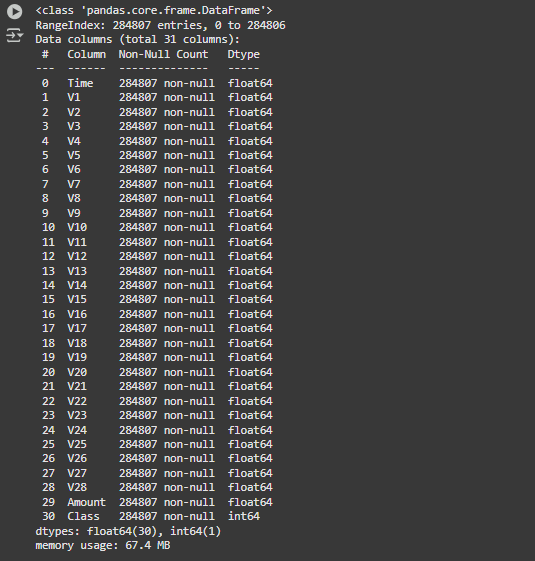

# 💳 Credit Card Fraud Detection

## 📌 Overview
This **Credit Card Fraud Detection** project utilizes machine learning techniques to detect fraudulent transactions. The project leverages **Python** and **Jupyter Notebook (.ipynb)** to analyze financial transaction data, preprocess it, and train predictive models to classify transactions as fraudulent or legitimate.

## ✨ Features
✅ **Data Preprocessing** – Handles missing values, feature scaling, and categorical encoding.  
✅ **Exploratory Data Analysis (EDA)** – Provides insights into transaction patterns and fraud trends.  
✅ **Machine Learning Models** – Implements classification algorithms like Logistic Regression, Decision Trees, Random Forest, etc.  
✅ **Model Evaluation** – Uses accuracy, precision, recall, F1-score, and confusion matrices to assess performance.  
✅ **Fraud Detection Pipeline** – Automates data cleaning, training, and prediction for new transactions.  

---

## ✨ Features
[Download Dataset from Dropbox](https://www.dropbox.com/scl/fi/r62f15fxq83frcrt6z8oo/creditcard.csv?rlkey=08j8gbm98xy4wndtq4exar8mf&st=xbjxp7xw&dl=0)

---

## 📸 Screenshots

### 📊 Data Exploration


### 🤖 Model Training


### ⚠️ Fraud Detection Results


---

## 🚀 How to Run the Project

### **1️⃣ Install Python and Jupyter Notebook**  
Ensure you have **Python 3.x** installed. Install Jupyter Notebook using:
```sh
pip install jupyterlab
```

### **2️⃣ Clone or Download the Project**
```sh
git clone https://github.com/Sudhanshu-2596/credit-card-fraud-detection.git
cd credit-card-fraud-detection
```

### **3️⃣ Install Required Dependencies**
```sh
pip install pandas numpy matplotlib seaborn scikit-learn imbalanced-learn
```

### **4️⃣ Open Jupyter Notebook**
```sh
jupyter notebook
```

---

## 📌 Requirements
✅ **Python 3.10**  
✅ **Jupyter Notebook**  
✅ **Libraries Used:**  
- **pandas** – Data manipulation  
- **numpy** – Numerical computing  
- **matplotlib & seaborn** – Data visualization  
- **scikit-learn** – Machine learning models  
- **imbalanced-learn** – Handles class imbalance in fraud detection  

---

## 🛠 Future Enhancements  
🔹 **Real-time Fraud Detection API** – Deploy the model as a web service using Flask or FastAPI.  
🔹 **Deep Learning Models** – Improve fraud detection using neural networks.  
🔹 **Blockchain Integration** – Enhance security and prevent fraudulent transactions.  
🔹 **Deployment on Cloud** – Deploy the model on AWS/GCP for real-time fraud detection.  

---

## 👨‍💻 Author
👤 **Sudhanshu Raj**  
📧 Email: sudhanshuraj259@gmail.com   
🔹 GitHub: https://github.com/Sudhanshu-2596  

---
